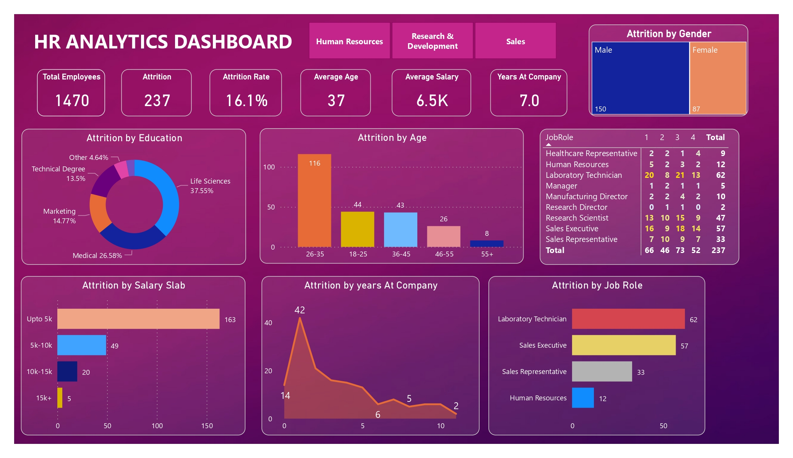

# HR Analytics Dashboard | Power BI

An interactive Power BI dashboard that analyzes employee attrition for a workforce of 1,470 employees, breaking it down by age, education, salary slab, tenure, gender and job role.

## Overview
The dashboard tracks an overall attrition rate of 16.1% (237 of 1,470 employees) and helps identify which employee groups are leaving the most.

## Dashboard Components
- **KPI cards:** Total Employees (1,470), Attrition (237), Attrition Rate (16.1%), Average Age (37), Average Salary (6.5K), Years at Company (7.0)
- **Attrition by Age:** age-group comparison (18-25, 26-35, 36-45, 46-55, 55+)
- **Attrition by Education:** donut chart showing the share of attrition by education background
- **Attrition by Salary Slab:** Up to 5K, 5K-10K, 10K-15K, 15K+
- **Attrition by Years at Company:** trend of exits across tenure
- **Attrition by Gender:** male vs female comparison
- **Attrition by Job Role:** bar chart of the top roles, plus a job-role matrix with counts across levels 1 to 4
- **Department tabs:** navigation buttons for Human Resources, Research & Development and Sales

## Key Insights
- **Age:** employees aged 26-35 account for 116 of the 237 exits (about 49%), the highest of any age group
- **Salary:** the lowest salary slab (up to 5K) has 163 exits (about 69%), and attrition drops as salary increases (49 in 5K-10K, 20 in 10K-15K, 5 in 15K+)
- **Tenure:** attrition peaks at 42 exits in the first year at the company and declines with longer tenure
- **Job role:** Laboratory Technicians (62) and Sales Executives (57) have the most exits, followed by Sales Representatives (33) and Human Resources (12) in the top-role chart
- **Education:** Life Sciences (37.55%) and Medical (26.58%) make up the largest shares of attrition
- **Gender:** 150 male and 87 female employees left

## Tools
Power BI

## Files
- `HR_Analytics_Dashboard.pdf`: dashboard export

## Author
Arhab Ahmad
